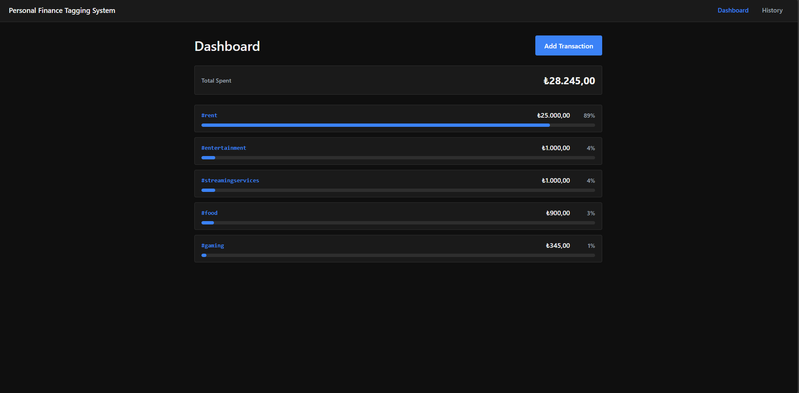
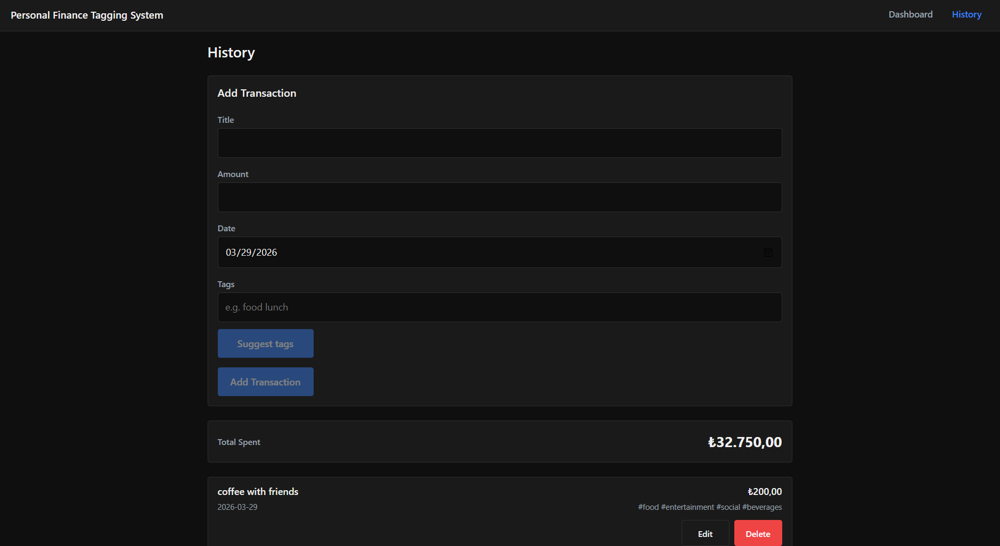
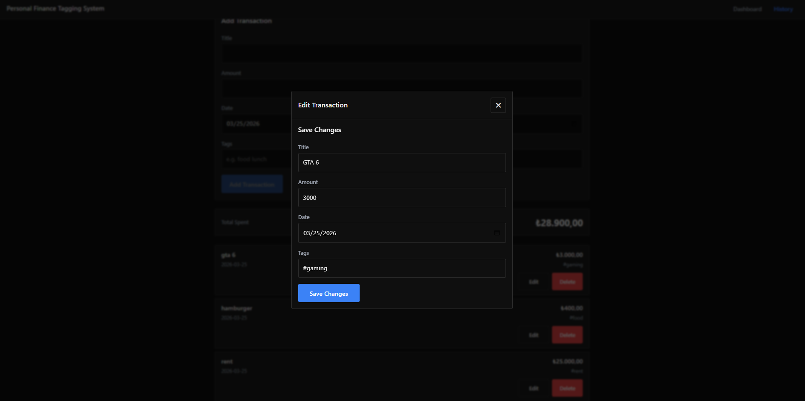
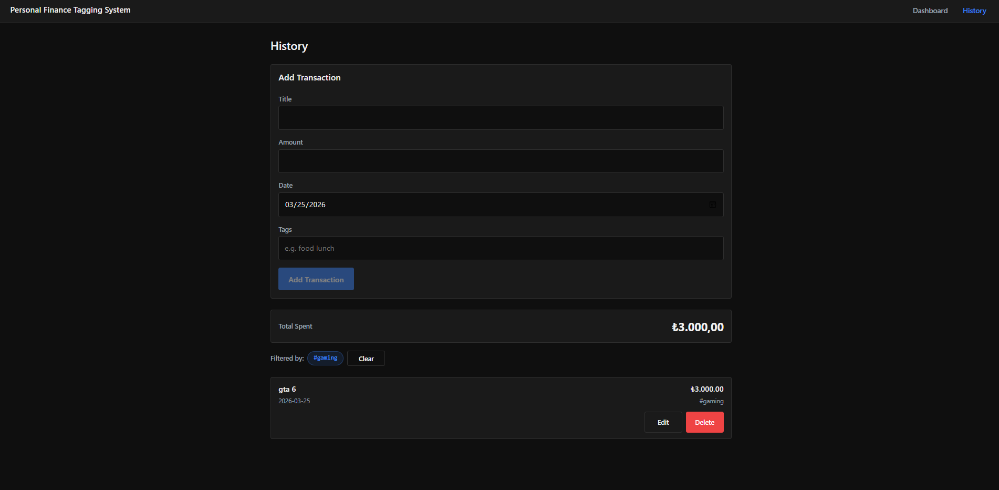

# Personal Finance Tagging System

A mobile-first personal expense tracker that supports multi-tagging (e.g. `#food #fun`) with local persistence, tag analytics, and optional AI-powered tag suggestions.

## Features

### Transaction Entry & Management
- Add transactions with:
  - **Title**
  - **Amount** (positive numbers only)
  - **Date** (defaults to today)
  - **Tags** (required, multiple allowed)
- Tag input is **space-separated**:
  - Auto-adds `#` if missing
  - Case-insensitive (stored lowercase)
  - Deduplicated
  - Ignores stop-words: `and`, `ve`, `ile`  
    Example: `work and fun` → `#work #fun`
- **Quick Add**: add a new transaction from the Dashboard using a native `<dialog>` modal
- Edit transactions in a native `<dialog>` modal
- Delete transactions with a confirmation dialog

### AI Tag Suggestions (Optional)
- The transaction form includes a **“Suggest tags”** button.
- Uses a local backend endpoint: `POST /api/suggest-tags`
- Provider is configurable via environment variables:
  - **OpenAI** (`LLM_PROVIDER=openai`)
  - **Anthropic/Claude** (`LLM_PROVIDER=anthropic`)

### Transaction History
- Chronological list (most recent first)
- **Total Spent** shown at the top
- Tag filter via URL query:
  - `/history?tag=%23food`
- Clear filter control

### Spending Summary & Analytics (Dashboard)
- Total spent per tag
- Percentage of total spending per tag
- Click a tag to open History filtered by that tag

### Currency (Display Only)
- Select a **display currency** (default: **USD**) from the Dashboard.
- Supported: `USD`, `TRY`, `EUR`
- **No conversion** is applied (formatting only).
- Persisted in localStorage.

### Data Persistence
- Transactions stored in `localStorage` under:
  - `pfts.transactions.v1`
- Currency preference stored under:
  - `pfts.currency.v1`

## Screenshots

### Dashboard (Tag Analytics + Quick Add)


### History (Transactions List)


### Edit Transaction (Dialog)


### Filter by Tag


## Tech Stack
- React + Vite (JavaScript)
- React Router
- Express (local API for AI tag suggestions)
- OpenAI SDK + Anthropic SDK (provider-switchable)
- Vitest + React Testing Library

## Getting Started

### Install
```bash
npm install

Run (frontend only)
npm run dev

Run full app (frontend + AI backend)
npm run dev:full

Open the URL Vite prints (usually http://localhost:5173).


AI Backend Configuration

Create a local .env file (do not commit it):
cp .env.example .env

Then choose one provider:

OpenAI

LLM_PROVIDER=openai
OPENAI_API_KEY=your_key_here
PORT=8790

Anthropic (Claude)

LLM_PROVIDER=anthropic
ANTHROPIC_API_KEY=your_key_here
PORT=8790

Notes:

The frontend calls the backend via /api/... (Vite proxy in development).

Make sure the backend PORT matches your proxy target.

Scripts
npm run dev — start dev server

npm run server — start backend only

npm run dev:full — start frontend + backend together

npm run build — production build

npm run preview — preview production build

npm run lint — lint

npm run test:run — run tests once

Notes
Currency formatting uses tr-TR locale with a selectable currency (USD / TRY / EUR).